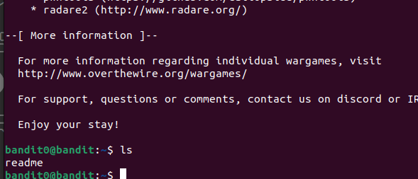

We need to use `ssh` to login as `bandit0` into the server. 
We simply use the ssh command `ssh username@server -p portnumber` which in this context is `ssh bandit0@bandit.labs.overthewire.org -p 2220`. 
We then enter the password to log in as `bandit0`. 
After logging in, we use `ls` command to see what files are there on the server.  
 
Then we use `cat` command to read the `readme` file.  
 
And hence we get the password for the next level: `NH2SXQwcBdpmTEzi3bvBHMM9H66vVXjL`.
