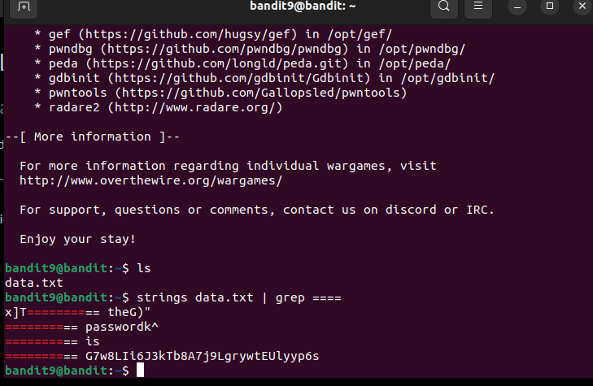

In this level, our password is in only one of the few human-readable lines and also next to a bunch of `=`'s. 
Hence, we will use `strings` piped with `grep`. 
Command: `strings data.txt| grep ====` 
 
Password: `G7w8LIi6J3kTb8A7j9LgrywtEUlyyp6s`
