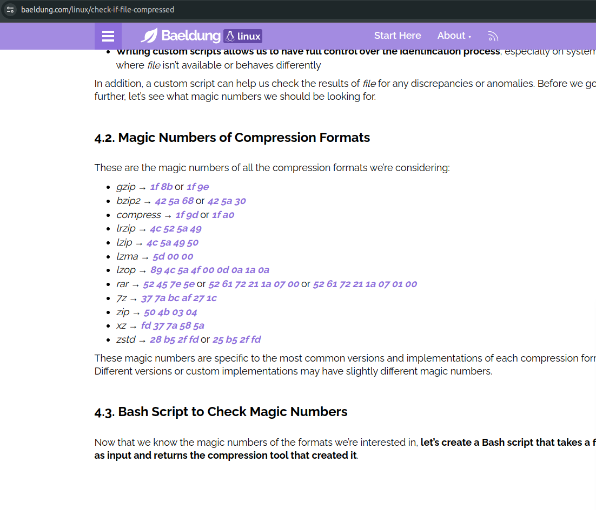
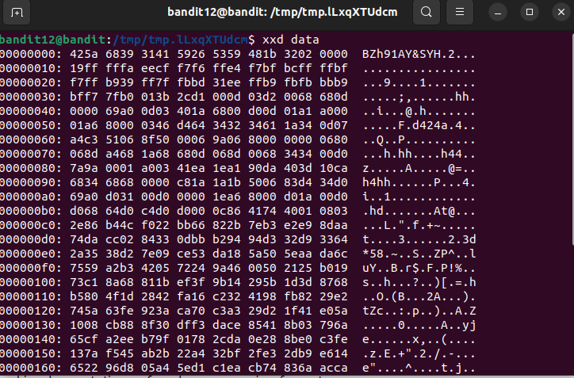
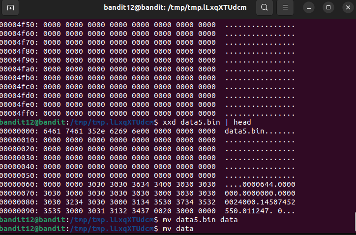
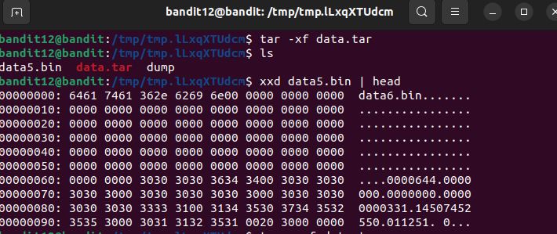

We are given hexdump of a file compressed many times. 
We make a temporary directory using `mktemp -d` and using `cp ~/data.txt .`. 
First, we reverse hexdump using command `mv data.txt dump` and then `xxd -r dump compress`. 
We see that starting bytes of file are `1f8b`. This is the signature of gzip compressed files. 
 
We rename the file using `mv compress data.gz` and then decompress it using `gzip -d data.gz`. 
We use `xxd data` to see the file type. The starting bytes are `425a`. 
 
This is signature of `bzip2` compression.  
Again the magic bytes are `1f8b`. Hence, we repeat the procdure and get something weird. It doesn't seem to have any magic bytes. 
  
But we can see the `data5.bin`. Thus, it seems that we have an archive now. Hence, we use `tar`. 
Command: `tar -xf data.tar` 
 
We again seem to have an archive. 
We again go thorught the same process and get `425a` as starting bytes of `data6.bin`. It is bzip2 compression.  
Now, we again get an archive. We retrieve `data8.bin`. 
This file is just a simple ascii file. We simply use `cat` to read the file. 
Password: `wbWdlBxEir4CaE8LaPhauuOo6pwRmrDw`