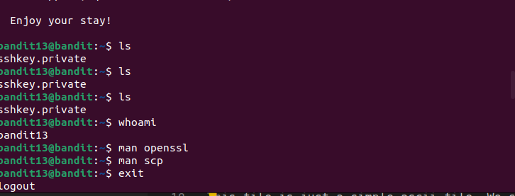
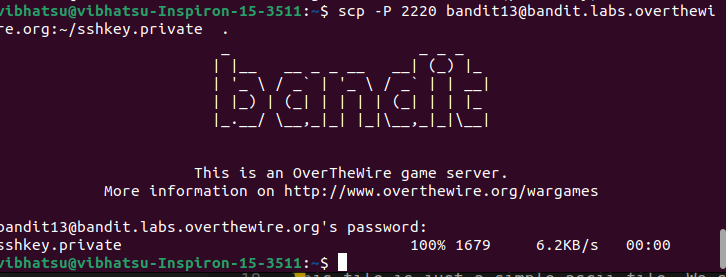

When we login, we see that there's an ssh-private on the server. 
 
It is said that we won't get password for the next level but a private key. 
Here, the challenge wants to teahc us that using password is not the only way to login to a server. We can also use sshkeys to do the same. 
 
We first use command `scp -P 2220 bandit13@bandit.labs.overthewire.org:~/sshkey.private .` 
 
Now, to login to next level, we will use `ssh -i ./sshkey.private bandit13@bandit.labs.overthewire.org -p 2220`. 
Then we can read the password of `bandit14` present inside `/etc/bandit_pass/bandit14`. 
Password: `fGrHPx402xGC7U7rXKDaxiWFTOiF0ENq`