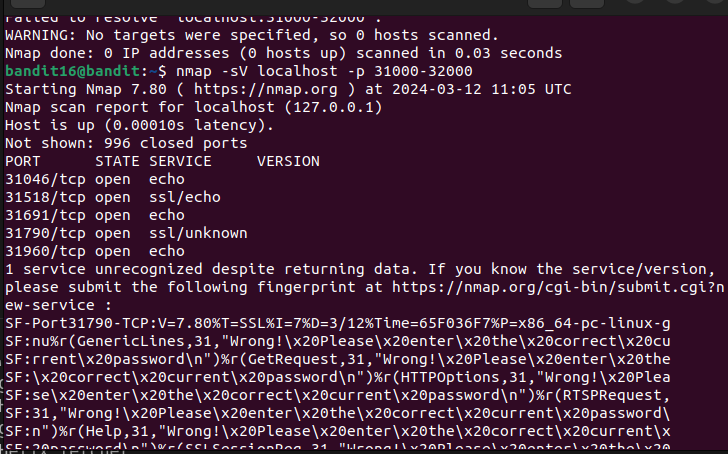

We need to first find which port speaks ssl and also what it does. 
For this, we need to scan ports. We will use `nmap` command for this. 
command: `nmap -sV localhost -p 31000-32000` 
With the flag `sV`, we are specifying the target and `p` specifies the port. 
It takes a few minutes to scan and after that, we get following results. 
 
There are 2 ports which speak ssl. However, one of them has echo as service which means it will just print whatever we input. 
Hence, we will connect to `31790` using netcat. 
command: `openssl s_client localhost:31790` 
We enter the password to get a private key. 
We copy that key and store it on our local machine. 
We then login as bandit17 and get the password from `/etc/bandit_pass/bandit17`. 
Password: `VwOSWtCA7lRKkTfbr2IDh6awj9RNZM5e`
