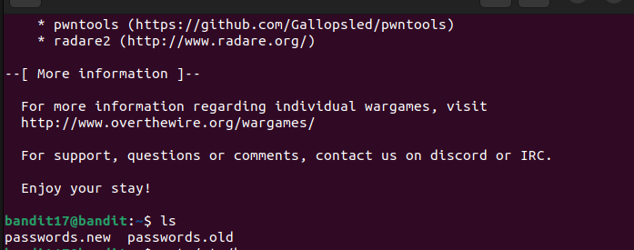
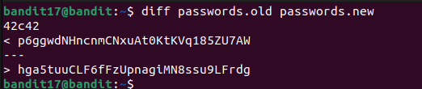

There are 2 files on the server. 
 
There is only one line different in them. 
Hence, we will use `diff` command to find that line. 
command: `diff password.old password.new` 
 
Password:`hga5tuuCLF6fFzUpnagiMN8ssu9LFrdg`
