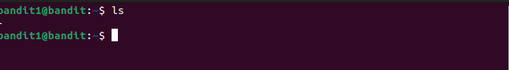

We log in as `bandit1` in the server. 
 
Interesting. Our filename starts with a special character. Hence,we will use `cat ./-` to read the file. 
We get the password for the next level `rRGizSaX8Mk1RTb1CNQoXTcYZWU6lgzi`. 

