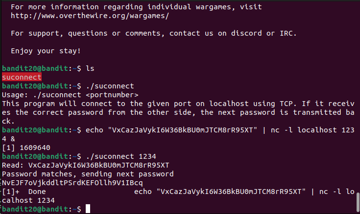

We first need to set up a listening connection to localhost on some port while sending the current password. 
We set this up using this command: `echo "VxCazJaVykI6W36BkBU0mJTCM8rR95XT" | nc -l localhost 1234 &` 
Here, we are echoing the password and sending it to localhost on through port 1234. `-l` flags means we are listening to this port and `&` means we are running this entire process in background. 
Then we will use binary to connect to port 1234 and it will give us the password for the next level. 
 
Password: `NvEJF7oVjkddltPSrdKEFOllh9V1IBcq`