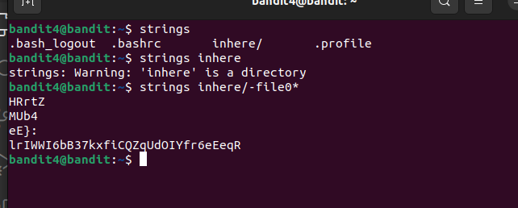

We login to see multiple files inside a directory. 
Now, we know that there's only 1 file that is human readable. 
For human-readable, we can use `strings` command along with wildchar `*` to get the password. 
Command: `strings inhere/file-0*` 
This command will print all sequences of readable lines from all files starting with `file-0`. 
 
Password: `lrIWWI6bB37kxfiCQZqUdOIYfr6eEeqR` 