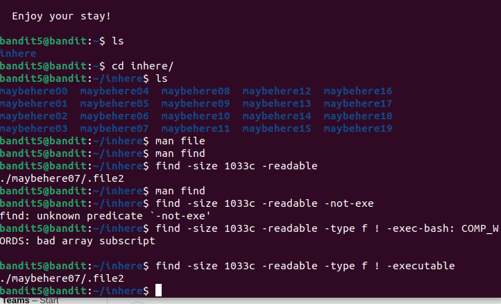

We need to find a file with following qualities: 
-human readable 
-1033 bytes in size 
-not executable 
We will use `find` command for this level. 
For human readable, we will use `-readable` flag. 
For size, we will use `-size 1033c` (as suffix c denotes size written in bytes.) 
For not executable, we will use `-type f ! -executable`. 
 
Password:`P4L4vucdmLnm8I7Vl7jG1ApGSfjYKqJU` 