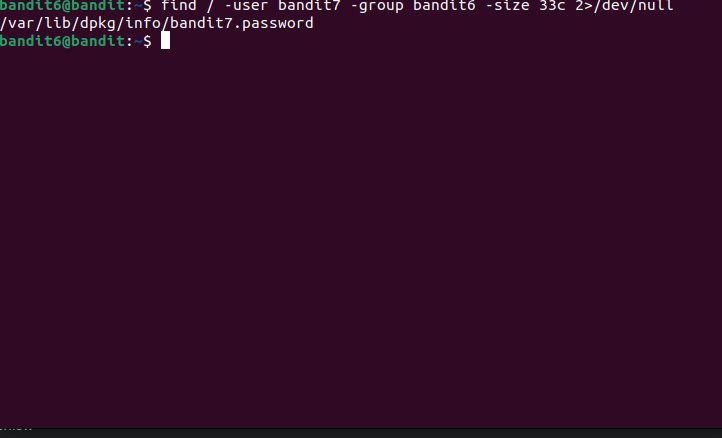

In this level, we want to find a file with these properties: 
-owned by user `bandit7` 
-owned by group `bandit6` 
-33 bytes in size 
Command: `find / -user bandit7 -group bandit6 -size 33c 2>/dev/null` 
 
Here, we have used `/` as we want to search in the entire system. Also, as we are logged in as bandit6, we may not have access to search in files owned by other users. Hence, to ignore output of such cases, we have used `2>/dev/null`. The other flags have their usual meanings. 
Password: `z7WtoNQU2XfjmMtWA8u5rN4vzqu4v99S` 