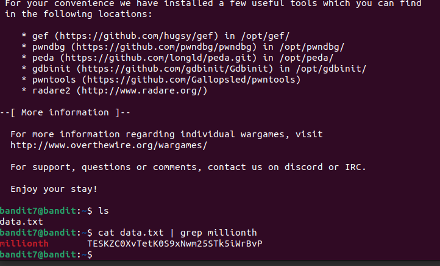

We just have a data.txt in home. It is said that the password is next to the word `millionth`. 
Hence, we use command `cat data.txt | grep millionth`. 
 
Here, `|` is used to run 2 commands and use output of 1st command as input 2nd. 
Password: `TESKZC0XvTetK0S9xNwm25STk5iWrBvP` 