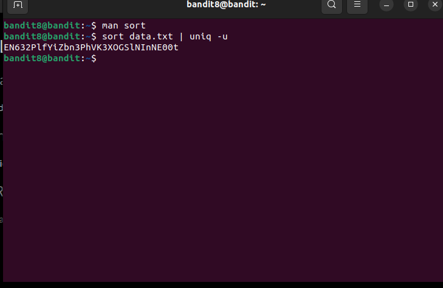

In this level, password is written only once while others are repeated.  
Hence, we will use `uniq -u` command which will print only unique lines. 
But for it to work, we need to have sorted lines. Hence, we will use `sort` first and then `uniq`. 
Command: `sort data.txt| uniq u` 
 
Password:`EN632PlfYiZbn3PhVK3XOGSlNInNE00t`